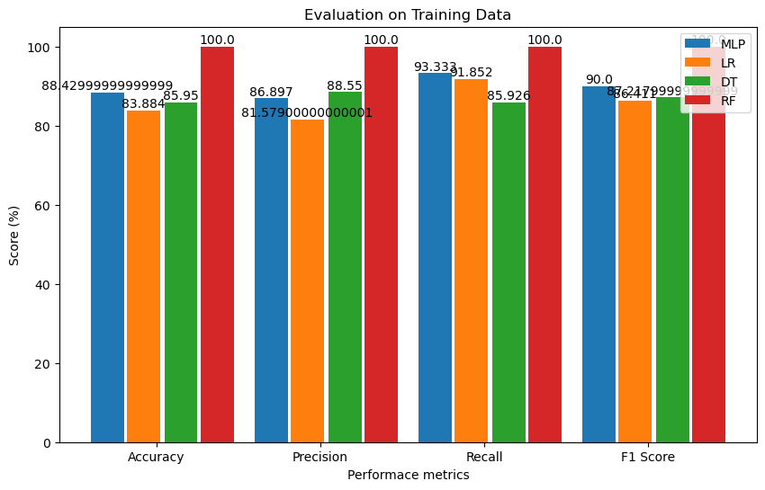
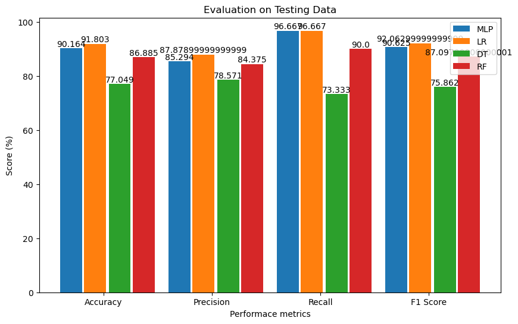

# Heart Disease

Heart disease is one of the most well-known and devastating diseases in the world, with many people dying from it each year.  Early identification of this condition is critical for saving people's lives.  Machine learning is one of the most convenient, rapid, and low-cost methods for illness detection.  Using the Cleveland heart disease dataset, this project create an ML model that can predict heart disease as accurately as feasible.  The properties of the dataset used to train the model, as well as the ML technique selected, have a substantial influence on the model's performance. The models created by training and testing the feature-selected dataset with various ML methods were evaluated and compared.

This projetc used different machine learning algorithms for predicting and analysis of diabetes, like **Multilayer Perceptron, Logistic Regression, Decision Tree, and Random Forest**. Standard Scaler is used to normalize the data and used data for the training and testing these proposed model. total data are split into 80-20 ration which contain 242 traning data and 61 data for testing.


## Prerequisite Library

There are some needed Libraries for this project to work. They are 

- numpy
- pandas
- sklearn
- matplotlib

> **Installation of numpy Library**
```bash
pip install numpy
```
> **Installation of pandas Library**
```bash
pip install pandas

```
> **Installation of scikit learn Library**
```bash
pip install -U scikit-learn
```
> **Installation of matplotlib Library**
```bash
pip install matplotlib
```
# Methodology


# Implementation
Following library are used for traing, testing and evaluating the overal projects:

```bash
## For data manupulation

panda
numpy
StandardScaler 


## For Visualization

matplotlib
seaborn

## For Performance Measures
accuracy_score 
precision_score  
recall_score  
f1_score 
confusion_matrix 

## For Model traning and  Teting
train_test_split 
MLPClassifier
LogisticRegression
RandomForestClassifier
DecisionTreeClassifier

```

# Result and Analysis
Different results are obtained based on the performance metrics (accuracy, precision, recall, and F1 score).  The results of training and testing with various machine learning algorithms are displayed in the bar graph below.




# Conclusion 
Among the several algorithms employed in this project.  Logistic Regression (LR) outperforms other algorithms, achieving 91.803% accuracy in  testing algorithm.
